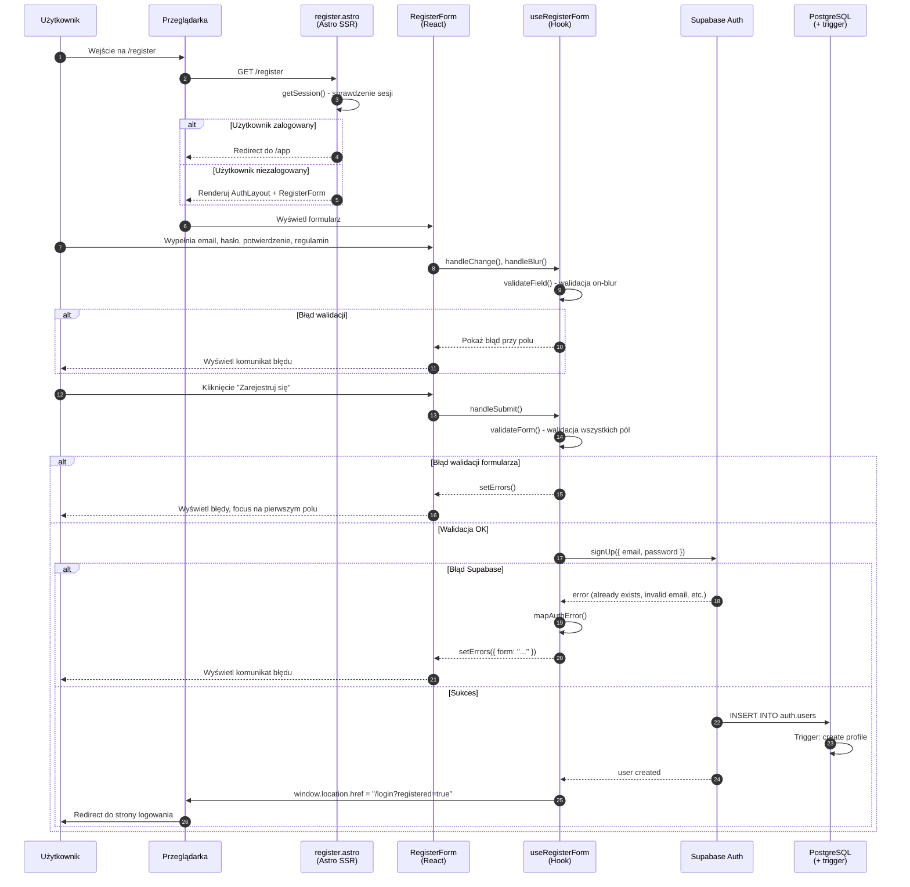
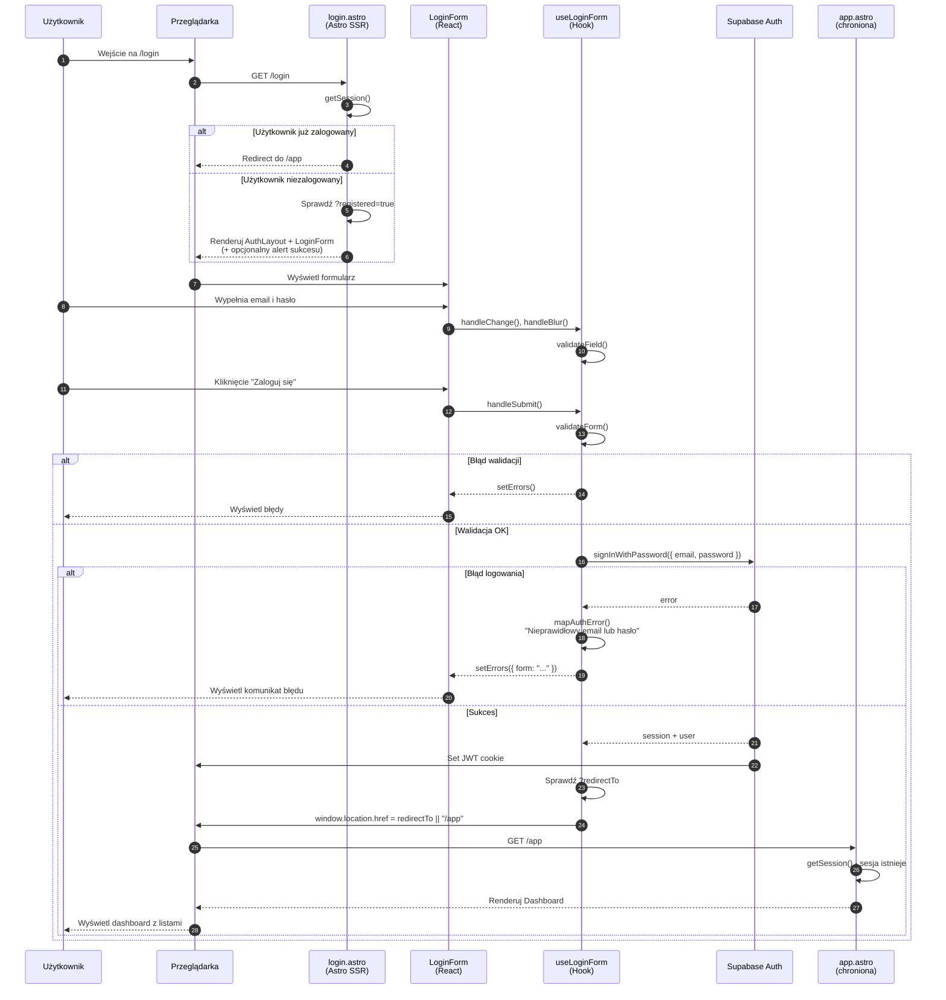
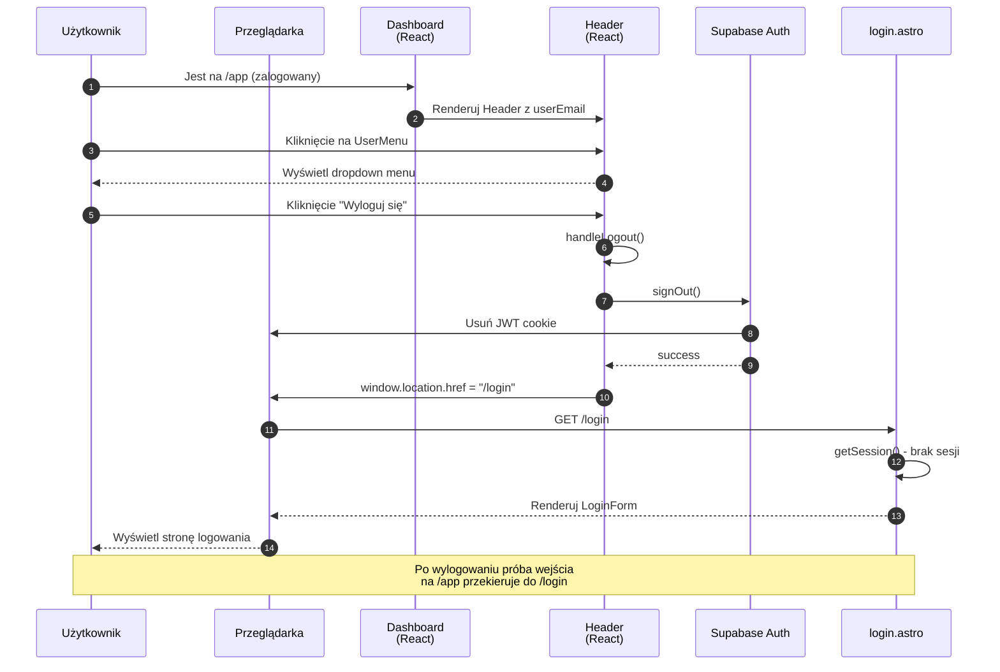
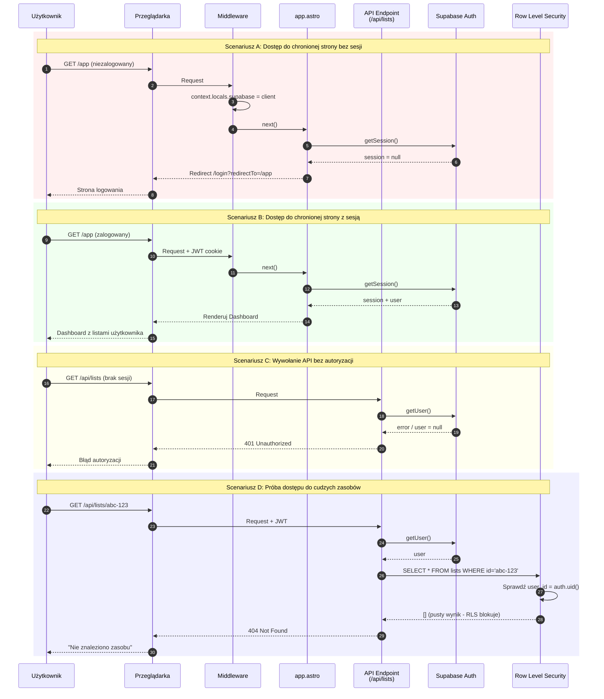
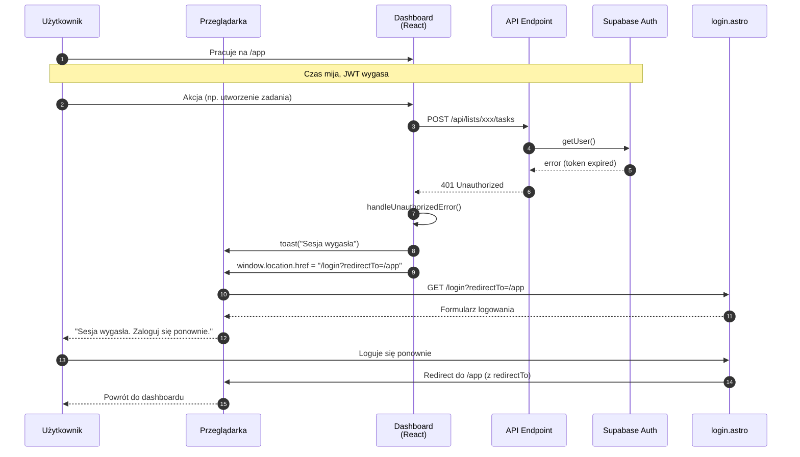
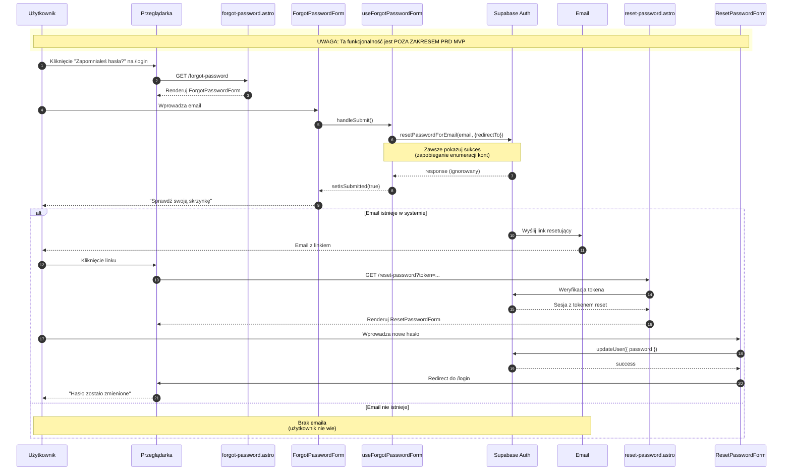
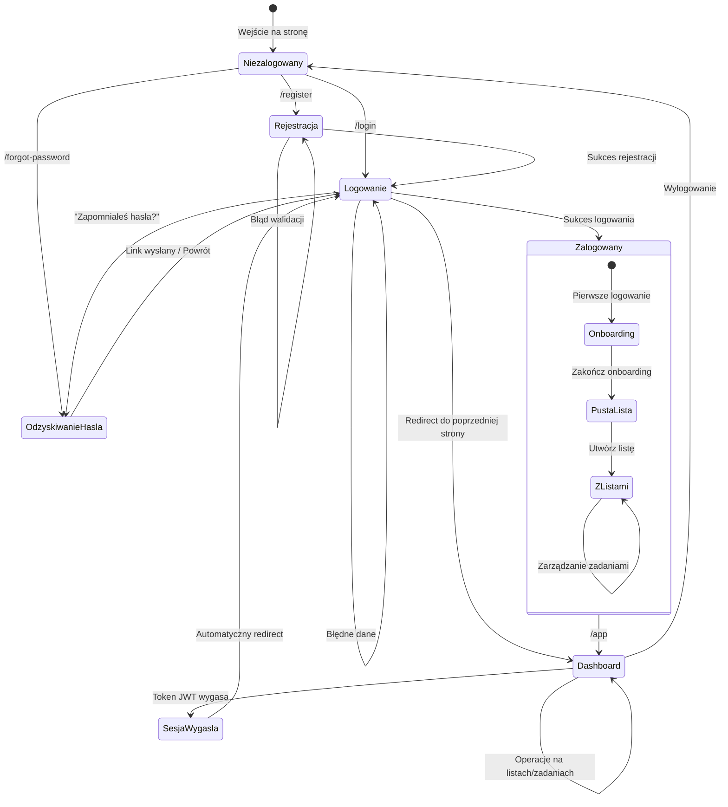

# Diagram przepływu autentykacji - AI Task Manager

## 1. Przegląd

Niniejszy dokument zawiera diagramy Mermaid opisujące przepływy autentykacji w aplikacji AI Task Manager, zgodnie z wymaganiami US-001, US-002, US-003 i US-004 z PRD oraz specyfikacją `auth-spec.md`.

---

## 2. Architektura komponentów autentykacji

```mermaid
graph TB
    subgraph "Strony Astro (Server-Side)"
        LOGIN["/login<br/>login.astro"]
        REGISTER["/register<br/>register.astro"]
        FORGOT["/forgot-password<br/>forgot-password.astro"]
        RESET["/reset-password<br/>reset-password.astro<br/>(DO UTWORZENIA)"]
        APP["/app<br/>app.astro"]
        INDEX["/<br/>index.astro"]
    end

    subgraph "Layouty"
        AUTH_LAYOUT["AuthLayout.astro<br/>(strony publiczne)"]
        DASH_LAYOUT["DashboardLayout.astro<br/>(strony chronione)"]
    end

    subgraph "Komponenty React (Client-Side)"
        LOGIN_FORM["LoginForm.tsx"]
        REGISTER_FORM["RegisterForm.tsx"]
        FORGOT_FORM["ForgotPasswordForm.tsx"]
        RESET_FORM["ResetPasswordForm.tsx<br/>(DO UTWORZENIA)"]
        DASHBOARD["Dashboard.tsx"]
        HEADER["Header.tsx<br/>(UserMenu + Logout)"]
    end

    subgraph "Hooki React"
        USE_LOGIN["useLoginForm.ts"]
        USE_REGISTER["useRegisterForm.ts"]
        USE_FORGOT["useForgotPasswordForm.ts"]
        USE_RESET["useResetPasswordForm.ts<br/>(DO UTWORZENIA)"]
        USE_PASSWORD["usePasswordStrength.ts"]
    end

    subgraph "Backend"
        MIDDLEWARE["middleware/index.ts"]
        SUPABASE_CLIENT["supabase.client.ts<br/>(server)"]
        SUPABASE_BROWSER["supabase.browser.ts<br/>(browser)"]
        API_LISTS["/api/lists/*"]
        API_TASKS["/api/tasks/*"]
        API_PROFILE["/api/profile"]
    end

    subgraph "Supabase Auth"
        SUPABASE_AUTH["Supabase Auth API"]
        RLS["Row Level Security"]
    end

    %% Relacje strony -> layout
    LOGIN --> AUTH_LAYOUT
    REGISTER --> AUTH_LAYOUT
    FORGOT --> AUTH_LAYOUT
    RESET --> AUTH_LAYOUT
    APP --> DASH_LAYOUT

    %% Relacje strona -> komponent
    LOGIN --> LOGIN_FORM
    REGISTER --> REGISTER_FORM
    FORGOT --> FORGOT_FORM
    RESET --> RESET_FORM
    APP --> DASHBOARD

    %% Relacje komponent -> hook
    LOGIN_FORM --> USE_LOGIN
    REGISTER_FORM --> USE_REGISTER
    REGISTER_FORM --> USE_PASSWORD
    FORGOT_FORM --> USE_FORGOT
    RESET_FORM --> USE_RESET
    RESET_FORM --> USE_PASSWORD
    DASHBOARD --> HEADER

    %% Relacje hook -> Supabase
    USE_LOGIN --> SUPABASE_BROWSER
    USE_REGISTER --> SUPABASE_BROWSER
    USE_FORGOT --> SUPABASE_BROWSER
    USE_RESET --> SUPABASE_BROWSER
    HEADER --> SUPABASE_BROWSER
    SUPABASE_BROWSER --> SUPABASE_AUTH

    %% Middleware
    MIDDLEWARE --> SUPABASE_CLIENT
    SUPABASE_CLIENT --> SUPABASE_AUTH

    %% API -> Supabase
    API_LISTS --> SUPABASE_AUTH
    API_TASKS --> SUPABASE_AUTH
    API_PROFILE --> SUPABASE_AUTH
    SUPABASE_AUTH --> RLS

    %% Style
    classDef astro fill:#ff6b6b,stroke:#333,stroke-width:2px,color:#fff
    classDef react fill:#61dafb,stroke:#333,stroke-width:2px,color:#000
    classDef hook fill:#764abc,stroke:#333,stroke-width:2px,color:#fff
    classDef backend fill:#68d391,stroke:#333,stroke-width:2px,color:#000
    classDef supabase fill:#3ecf8e,stroke:#333,stroke-width:2px,color:#000
    classDef todo fill:#ffd93d,stroke:#333,stroke-width:2px,color:#000

    class LOGIN,REGISTER,FORGOT,APP,INDEX astro
    class LOGIN_FORM,REGISTER_FORM,FORGOT_FORM,DASHBOARD,HEADER react
    class USE_LOGIN,USE_REGISTER,USE_FORGOT,USE_PASSWORD hook
    class MIDDLEWARE,SUPABASE_CLIENT,SUPABASE_BROWSER,API_LISTS,API_TASKS,API_PROFILE backend
    class SUPABASE_AUTH,RLS supabase
    class RESET,RESET_FORM,USE_RESET todo
```

---

## 3. Flow rejestracji (US-001)

---

## 4. Flow logowania (US-002)

---

## 5. Flow wylogowania (US-004)

---

## 6. Flow ochrony tras (US-003)

---

## 7. Flow wygaśnięcia sesji (US-003)

---

## 8. Flow odzyskiwania hasła (POZA ZAKRESEM PRD)

---

## 9. Diagram stanów sesji

---

## 10. Podsumowanie elementów

### 10.1. Komponenty biorące udział w autentykacji

| Typ             | Nazwa                 | Ścieżka                                        | Status                 |
| --------------- | --------------------- | ---------------------------------------------- | ---------------------- |
| Strona Astro    | login.astro           | `src/pages/login.astro`                        | ✅ Istnieje            |
| Strona Astro    | register.astro        | `src/pages/register.astro`                     | ✅ Istnieje            |
| Strona Astro    | forgot-password.astro | `src/pages/forgot-password.astro`              | ✅ Istnieje            |
| Strona Astro    | reset-password.astro  | `src/pages/reset-password.astro`               | ⚠️ Do utworzenia       |
| Strona Astro    | app.astro             | `src/pages/app.astro`                          | ✅ Istnieje            |
| Layout          | AuthLayout.astro      | `src/layouts/AuthLayout.astro`                 | ✅ Istnieje            |
| Komponent React | LoginForm             | `src/components/auth/LoginForm.tsx`            | ✅ Istnieje            |
| Komponent React | RegisterForm          | `src/components/auth/RegisterForm.tsx`         | ✅ Istnieje            |
| Komponent React | ForgotPasswordForm    | `src/components/auth/ForgotPasswordForm.tsx`   | ✅ Istnieje            |
| Komponent React | ResetPasswordForm     | `src/components/auth/ResetPasswordForm.tsx`    | ⚠️ Do utworzenia       |
| Komponent React | Dashboard             | `src/components/dashboard/Dashboard.tsx`       | ✅ Istnieje            |
| Komponent React | Header                | `src/components/dashboard/Header.tsx`          | ✅ Istnieje            |
| Hook            | useLoginForm          | `src/components/auth/useLoginForm.ts`          | ✅ Istnieje            |
| Hook            | useRegisterForm       | `src/components/auth/useRegisterForm.ts`       | ✅ Istnieje            |
| Hook            | useForgotPasswordForm | `src/components/auth/useForgotPasswordForm.ts` | ✅ Istnieje            |
| Hook            | useResetPasswordForm  | `src/components/auth/useResetPasswordForm.ts`  | ⚠️ Do utworzenia       |
| Hook            | usePasswordStrength   | `src/components/auth/usePasswordStrength.ts`   | ✅ Istnieje            |
| Middleware      | index.ts              | `src/middleware/index.ts`                      | ⚠️ Wymaga rozszerzenia |
| Klient Supabase | supabase.client.ts    | `src/db/supabase.client.ts`                    | ✅ Istnieje            |
| Klient Supabase | supabase.browser.ts   | `src/db/supabase.browser.ts`                   | ✅ Istnieje            |

### 10.2. Metody Supabase Auth używane w projekcie

| Metoda                    | Użycie                  | Plik                                         |
| ------------------------- | ----------------------- | -------------------------------------------- |
| `signInWithPassword()`    | Logowanie               | `useLoginForm.ts`                            |
| `signUp()`                | Rejestracja             | `useRegisterForm.ts`                         |
| `signOut()`               | Wylogowanie             | `Dashboard.tsx`                              |
| `resetPasswordForEmail()` | Wysłanie linku reset    | `useForgotPasswordForm.ts`                   |
| `updateUser()`            | Zmiana hasła            | `useResetPasswordForm.ts` (do utworzenia)    |
| `getSession()`            | Weryfikacja sesji (SSR) | `login.astro`, `register.astro`, `app.astro` |
| `getUser()`               | Weryfikacja w API       | `src/pages/api/**/*.ts`                      |
