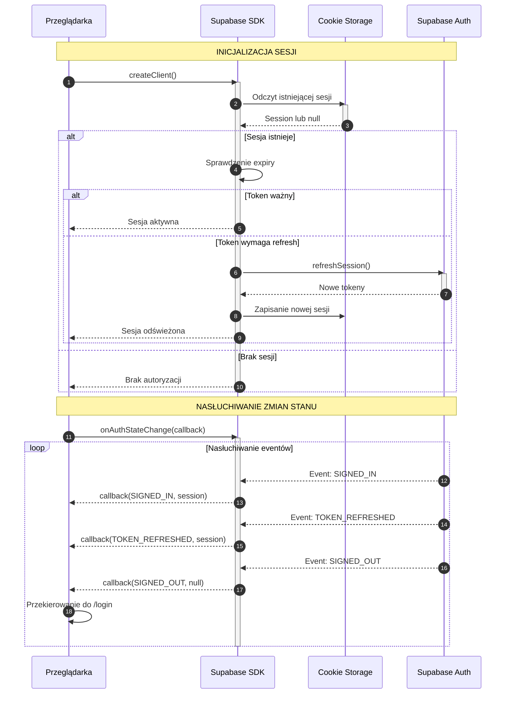
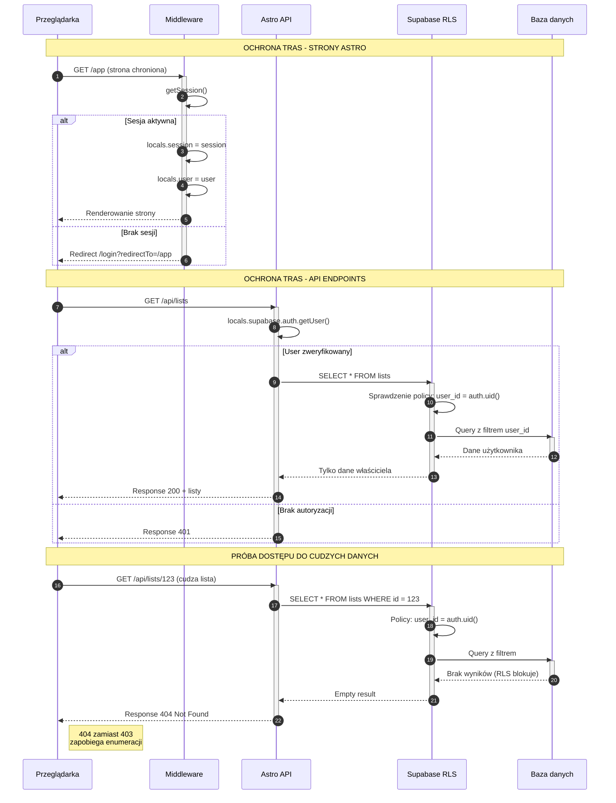

# Diagram architektury autentykacji - AI Task Manager

## Opis

Diagram przedstawia przepływ autentykacji w aplikacji AI Task Manager wykorzystującej Astro, React i Supabase Auth. Obejmuje rejestrację, logowanie, weryfikację sesji, ochronę tras API oraz wylogowanie.

## Diagram główny - Przepływy autentykacji

```mermaid
sequenceDiagram
    autonumber

    participant Browser as Przeglądarka
    participant Middleware as Middleware Astro
    participant API as Astro API
    participant Supabase as Supabase Auth

    %% ========== REJESTRACJA ==========
    rect rgb(240, 253, 244)
    Note over Browser,Supabase: PROCES REJESTRACJI (US-001)

    Browser->>Browser: Wypełnienie formularza rejestracji
    activate Browser
    Browser->>Browser: Walidacja client-side
    Browser->>Supabase: signUp(email, password)
    activate Supabase

    alt Rejestracja udana
        Supabase-->>Browser: Sukces + user data
        deactivate Supabase
        Browser->>Browser: Przekierowanie do /login?registered=true
    else Email zajęty lub błąd
        Supabase-->>Browser: Błąd rejestracji
        Browser->>Browser: Wyświetlenie komunikatu błędu
    end
    deactivate Browser
    end

    %% ========== LOGOWANIE ==========
    rect rgb(254, 249, 195)
    Note over Browser,Supabase: PROCES LOGOWANIA (US-002)

    Browser->>Browser: Wypełnienie formularza logowania
    activate Browser
    Browser->>Browser: Walidacja client-side
    Browser->>Supabase: signInWithPassword(email, password)
    activate Supabase

    alt Logowanie udane
        Supabase-->>Browser: JWT Access Token + Refresh Token
        deactivate Supabase
        Browser->>Browser: Zapisanie sesji w cookies
        Browser->>Browser: Przekierowanie do /app
    else Błędne dane
        Supabase-->>Browser: Błąd auth
        Browser->>Browser: Komunikat: Nieprawidłowy email lub hasło
        Note right of Browser: Generyczny komunikat<br/>zapobiega enumeracji
    end
    deactivate Browser
    end

    %% ========== WERYFIKACJA SESJI W MIDDLEWARE ==========
    rect rgb(239, 246, 255)
    Note over Browser,Supabase: WERYFIKACJA SESJI - MIDDLEWARE (US-003)

    Browser->>Middleware: Request do chronionej strony
    activate Middleware
    Middleware->>Middleware: Utworzenie klienta Supabase
    Middleware->>Supabase: getSession()
    activate Supabase
    Supabase-->>Middleware: Session lub null
    deactivate Supabase

    alt Sesja aktywna
        Middleware->>Middleware: Ustawienie context.locals.session
        Middleware->>API: Kontynuacja request
    else Brak sesji lub wygasła
        Middleware-->>Browser: Redirect do /login?redirectTo=path
        Note right of Browser: Zapamiętanie<br/>poprzedniej strony
    end
    deactivate Middleware
    end

    %% ========== WERYFIKACJA W API ==========
    rect rgb(254, 242, 242)
    Note over Browser,Supabase: WERYFIKACJA W API ENDPOINT

    Browser->>API: Request do API z JWT
    activate API
    API->>Supabase: getUser()
    activate Supabase

    alt Token ważny
        Supabase-->>API: User data
        deactivate Supabase
        API->>API: Wykonanie logiki biznesowej
        Note over API,Supabase: RLS wymusza autoryzację<br/>na poziomie bazy danych
        API-->>Browser: Response 200 + dane
    else Token nieważny
        Supabase-->>API: Błąd auth
        API-->>Browser: Response 401 Unauthorized
        Browser->>Browser: Przekierowanie do /login
    end
    deactivate API
    end

    %% ========== ODŚWIEŻANIE TOKENU ==========
    rect rgb(243, 232, 255)
    Note over Browser,Supabase: AUTOMATYCZNE ODŚWIEŻANIE TOKENU

    Browser->>Browser: Token bliski wygaśnięcia
    activate Browser
    Browser->>Supabase: Automatyczny refresh (SDK)
    activate Supabase

    alt Refresh udany
        Supabase-->>Browser: Nowy Access Token
        Browser->>Browser: Aktualizacja sesji
    else Refresh token wygasł
        Supabase-->>Browser: Błąd refresh
        Browser->>Browser: onAuthStateChange: SIGNED_OUT
        Browser->>Browser: Przekierowanie do /login
    end
    deactivate Supabase
    deactivate Browser
    end

    %% ========== WYLOGOWANIE ==========
    rect rgb(254, 226, 226)
    Note over Browser,Supabase: PROCES WYLOGOWANIA (US-004)

    Browser->>Browser: Kliknięcie Wyloguj się
    activate Browser
    Browser->>Supabase: signOut()
    activate Supabase
    Supabase-->>Browser: Sukces
    deactivate Supabase
    Browser->>Browser: Usunięcie sesji z cookies
    Browser->>Browser: Przekierowanie do /login
    deactivate Browser
    end

    %% ========== RESET HASŁA ==========
    rect rgb(219, 234, 254)
    Note over Browser,Supabase: RESET HASŁA (dodatkowe)

    Browser->>Browser: Wypełnienie formularza reset
    activate Browser
    Browser->>Supabase: resetPasswordForEmail(email)
    activate Supabase
    Supabase-->>Browser: Zawsze sukces
    deactivate Supabase
    Browser->>Browser: Wyświetlenie komunikatu sukcesu
    Note right of Browser: Sukces niezależnie<br/>od istnienia konta
    deactivate Browser
    end
```

<mermaid_diagram>



</mermaid_diagram>

## Diagram szczegółowy - Cykl życia sesji

<mermaid_diagram>



</mermaid_diagram>

## Diagram - Ochrona tras i RLS

<mermaid_diagram>



</mermaid_diagram>

## Legenda

### Typy strzałek

| Strzałka | Znaczenie                        |
| -------- | -------------------------------- |
| `->>`    | Request synchroniczny            |
| `-->>`   | Response                         |
| `->`     | Akcja lokalna                    |
| `-->`    | Response z błędem lub opcjonalny |

### Kolory sekcji

| Kolor              | Proces                                |
| ------------------ | ------------------------------------- |
| 🟢 Zielony         | Rejestracja (US-001)                  |
| 🟡 Żółty           | Logowanie (US-002)                    |
| 🔵 Niebieski jasny | Weryfikacja sesji middleware (US-003) |
| 🔴 Czerwony jasny  | Weryfikacja API                       |
| 🟣 Fioletowy       | Odświeżanie tokenu                    |
| 🔴 Czerwony        | Wylogowanie (US-004)                  |
| 🔵 Niebieski       | Reset hasła                           |

### Aktorzy

| Aktor         | Odpowiedzialność                                |
| ------------- | ----------------------------------------------- |
| Przeglądarka  | UI, formularze React, przechowywanie sesji      |
| Middleware    | Ochrona tras, weryfikacja sesji, context.locals |
| Astro API     | Endpointy, logika biznesowa, serwisy            |
| Supabase Auth | Autentykacja, tokeny JWT, sesje                 |
| Supabase RLS  | Autoryzacja na poziomie bazy danych             |

## Mapowanie na User Stories

| User Story               | Przepływ                            | Aktorzy           |
| ------------------------ | ----------------------------------- | ----------------- |
| US-001 Rejestracja       | signUp → sukces/błąd → redirect     | Browser, Supabase |
| US-002 Logowanie         | signInWithPassword → JWT → redirect | Browser, Supabase |
| US-003 Bezpieczny dostęp | getSession/getUser → RLS → dostęp   | MW, API, RLS      |
| US-004 Wylogowanie       | signOut → clear → redirect          | Browser, Supabase |

## Kluczowe mechanizmy bezpieczeństwa

### 1. Zapobieganie enumeracji kont

- Logowanie: generyczny komunikat "Nieprawidłowy email lub hasło"
- Reset hasła: zawsze sukces niezależnie od istnienia konta
- Dostęp do cudzych zasobów: 404 zamiast 403

### 2. Ochrona tokenów

- Access Token: krótkotrwały JWT (domyślnie 1h)
- Refresh Token: długotrwały, przechowywany w secure cookie
- Automatyczne odświeżanie przez Supabase SDK

### 3. Row Level Security (RLS)

- Wszystkie tabele chronione politykami RLS
- Policy: `user_id = auth.uid()`
- Izolacja danych na poziomie bazy danych

### 4. Ochrona tras

- Middleware weryfikuje sesję dla stron chronionych
- API weryfikuje użytkownika dla każdego requestu
- Przekierowanie z zapamiętaniem poprzedniej strony (redirectTo)

## Tokeny i sesje

### Access Token (JWT)

```
{
  "sub": "user-uuid",
  "email": "user@example.com",
  "role": "authenticated",
  "exp": 1234567890
}
```

### Przechowywanie sesji

- **Server-side**: `context.locals.session`
- **Client-side**: Cookies (secure, httpOnly)
- **SDK**: Automatyczne zarządzanie przez Supabase

### Cykl życia tokenu

1. **Utworzenie**: Po udanym logowaniu
2. **Weryfikacja**: Przy każdym żądaniu
3. **Odświeżenie**: Automatycznie przed wygaśnięciem
4. **Usunięcie**: Przy wylogowaniu lub wygaśnięciu refresh token
