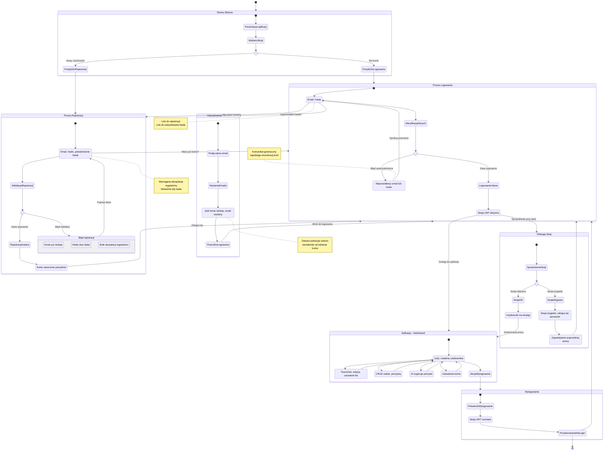

# Diagram podróży użytkownika - Moduł Autentykacji

## Opis

Diagram przedstawia podróże użytkownika dla modułu autentykacji aplikacji AI Task Manager. Obejmuje rejestrację, logowanie, odzyskiwanie hasła, korzystanie z aplikacji oraz wylogowanie.

## Diagram

<mermaid_diagram>



</mermaid_diagram>

## Legenda stanów

| Stan                  | Opis                         | User Story |
| --------------------- | ---------------------------- | ---------- |
| Strona Główna         | Punkt wejścia do aplikacji   | -          |
| Proces Rejestracji    | Tworzenie nowego konta       | US-001     |
| Proces Logowania      | Uwierzytelnienie użytkownika | US-002     |
| Odzyskiwanie Hasła    | Reset hasła przez email      | Dodatkowe  |
| Aplikacja - Dashboard | Główna funkcjonalność        | US-003     |
| Obsługa Sesji         | Weryfikacja autoryzacji      | US-003     |
| Wylogowanie           | Zakończenie sesji            | US-004     |

## Szczegółowy opis podróży

### 1. Podróż nowego użytkownika (US-001)

```
Strona Główna → Rejestracja → Formularz → Walidacja → Sukces → Logowanie
```

**Kroki:**

1. Użytkownik wchodzi na stronę główną
2. Klika "Zarejestruj się"
3. Wypełnia formularz (email, hasło, potwierdzenie, regulamin)
4. Widzi wskaźnik siły hasła
5. System waliduje dane
6. Przy błędzie → komunikat błędu, powrót do formularza
7. Przy sukcesie → komunikat sukcesu, przekierowanie do logowania

**Możliwe błędy:**

- Email już zajęty
- Hasło zbyt słabe
- Hasła nie są identyczne
- Brak akceptacji regulaminu

### 2. Podróż istniejącego użytkownika - logowanie (US-002)

```
Strona Główna → Logowanie → Formularz → Weryfikacja → Sesja → Dashboard
```

**Kroki:**

1. Użytkownik wchodzi na stronę główną
2. Klika "Zaloguj się"
3. Wypełnia formularz (email, hasło)
4. System weryfikuje dane
5. Przy błędzie → komunikat generyczny "Nieprawidłowy email lub hasło"
6. Przy sukcesie → utworzenie sesji JWT, przekierowanie do Dashboard

**Bezpieczeństwo:**

- Komunikat błędu nie zdradza, czy email istnieje (zapobieganie enumeracji)

### 3. Podróż odzyskiwania hasła (dodatkowe)

```
Formularz Logowania → Reset Hasła → Email → Sukces → Powrót do Logowania
```

**Kroki:**

1. Na stronie logowania użytkownik klika "Zapomniałeś hasła?"
2. Wprowadza adres email
3. System wysyła email z linkiem (jeśli konto istnieje)
4. Zawsze pokazuje komunikat sukcesu (zapobieganie enumeracji)
5. Użytkownik wraca do formularza logowania

### 4. Podróż zalogowanego użytkownika (US-003)

```
Dashboard → [Listy | Zadania | AI | Profil] → Dashboard → Wylogowanie
```

**Dostępne akcje:**

- Zarządzanie listami zadań
- CRUD zadań z priorytetami
- Sugestie AI dla priorytetów
- Ustawienia profilu
- Wylogowanie

### 5. Podróż sesji wygasłej (US-003)

```
Akcja chroniona → Sprawdzenie sesji → Wygaśnięcie → Komunikat → Logowanie → Powrót
```

**Kroki:**

1. Użytkownik wykonuje akcję wymagającą autoryzacji
2. System sprawdza sesję → wygasła
3. Wyświetla komunikat "Sesja wygasła"
4. Zapamiętuje poprzednią stronę (redirectTo)
5. Przekierowuje do logowania
6. Po zalogowaniu → powrót do poprzedniej strony

### 6. Podróż wylogowania (US-004)

```
Dashboard → Wylogowanie → Usunięcie sesji → Strona logowania
```

**Kroki:**

1. Użytkownik klika "Wyloguj się" w nagłówku
2. System usuwa sesję JWT
3. Przekierowanie do strony logowania
4. Dostęp do Dashboard zablokowany do ponownego logowania

## Punkty decyzyjne

| Punkt                      | Warunek             | Ścieżka TAK        | Ścieżka NIE                 |
| -------------------------- | ------------------- | ------------------ | --------------------------- |
| Posiada konto?             | Użytkownik ma konto | Logowanie          | Rejestracja                 |
| Dane rejestracji poprawne? | Walidacja OK        | Sukces rejestracji | Błąd walidacji              |
| Dane logowania poprawne?   | Auth OK             | Dashboard          | Błąd logowania              |
| Sesja aktywna?             | JWT ważny           | Dostęp do zasobów  | Przekierowanie do logowania |

## Mapowanie na User Stories

| User Story               | Podróż                    | Status              |
| ------------------------ | ------------------------- | ------------------- |
| US-001 Rejestracja konta | Proces Rejestracji        | ✅ Zaimplementowane |
| US-002 Logowanie         | Proces Logowania          | ✅ Zaimplementowane |
| US-003 Bezpieczny dostęp | Obsługa Sesji + Dashboard | ⚠️ Częściowo        |
| US-004 Wylogowanie       | Wylogowanie               | ✅ Zaimplementowane |
