# Diagram architektury UI - Moduł Autentykacji

## Opis

Diagram przedstawia architekturę interfejsu użytkownika dla modułu autentykacji aplikacji AI Task Manager. Obejmuje strony Astro, komponenty React, hooki, typy oraz integrację z Supabase Auth.

## Diagram

```mermaid
flowchart TD
    subgraph "Layouty Astro"
        AuthLayout["AuthLayout.astro<br/>Layout stron auth"]
        DashboardLayout["DashboardLayout.astro<br/>Layout stron chronionych"]
    end

    subgraph "Strony Publiczne"
        IndexPage["index.astro<br/>Strona główna"]
        LoginPage["login.astro<br/>Strona logowania"]
        RegisterPage["register.astro<br/>Strona rejestracji"]
        ForgotPasswordPage["forgot-password.astro<br/>Odzyskiwanie hasła"]
    end

    subgraph "Strony Chronione"
        AppPage["app.astro<br/>Dashboard aplikacji"]
    end

    subgraph "Komponenty Auth"
        LoginForm["LoginForm.tsx<br/>Formularz logowania"]
        RegisterForm["RegisterForm.tsx<br/>Formularz rejestracji"]
        ForgotPasswordForm["ForgotPasswordForm.tsx<br/>Formularz reset hasła"]
        PasswordStrength["PasswordStrengthIndicator.tsx<br/>Wskaźnik siły hasła"]
        SuccessMessage["SuccessMessage<br/>Komunikat sukcesu"]
    end

    subgraph "Hooki Auth"
        useLoginForm["useLoginForm.ts<br/>Stan logowania"]
        useRegisterForm["useRegisterForm.ts<br/>Stan rejestracji"]
        useForgotPassword["useForgotPasswordForm.ts<br/>Stan reset hasła"]
        usePasswordStrength["usePasswordStrength.ts<br/>Siła hasła"]
    end

    subgraph "Typy Auth"
        AuthTypes["types.ts"]
        LoginTypes["LoginFormValues<br/>LoginFormErrors"]
        RegisterTypes["RegisterFormValues<br/>RegisterFormErrors"]
        ForgotTypes["ForgotPasswordFormValues<br/>ForgotPasswordFormErrors"]
        PasswordTypes["PasswordStrength<br/>PasswordStrengthResult"]
    end

    subgraph "Komponenty Dashboard"
        Dashboard["Dashboard.tsx<br/>Główny dashboard"]
        Header["Header.tsx<br/>Nagłówek z menu"]
        Sidebar["Sidebar.tsx<br/>Panel boczny"]
        MainContent["MainContent.tsx<br/>Zawartość główna"]
    end

    subgraph "Supabase"
        SupabaseClient["supabase.client.ts<br/>Klient server-side"]
        SupabaseBrowser["supabase.browser.ts<br/>Klient browser-side"]
        SupabaseAuth["Supabase Auth API"]
    end

    subgraph "Middleware"
        MiddlewareIndex["middleware/index.ts<br/>Ochrona tras"]
        SessionCheck{{"Weryfikacja sesji"}}
    end

    subgraph "API Auth"
        ProfileAPI["api/profile<br/>Profil użytkownika"]
        ListsAPI["api/lists<br/>Listy zadań"]
        TasksAPI["api/tasks<br/>Zadania"]
        AiAPI["api/ai<br/>Sugestie AI"]
    end

    subgraph "Operacje Auth"
        SignIn["signInWithPassword<br/>Logowanie"]
        SignUp["signUp<br/>Rejestracja"]
        SignOut["signOut<br/>Wylogowanie"]
        ResetPassword["resetPasswordForEmail<br/>Reset hasła"]
    end

    %% Połączenia Layoutów ze Stronami
    AuthLayout --> LoginPage
    AuthLayout --> RegisterPage
    AuthLayout --> ForgotPasswordPage
    DashboardLayout --> AppPage

    %% Połączenia Stron z Komponentami
    LoginPage --> LoginForm
    RegisterPage --> RegisterForm
    ForgotPasswordPage --> ForgotPasswordForm
    AppPage --> Dashboard

    %% Połączenia Komponentów Auth z Hookami
    LoginForm --> useLoginForm
    RegisterForm --> useRegisterForm
    RegisterForm --> PasswordStrength
    ForgotPasswordForm --> useForgotPassword
    ForgotPasswordForm -.-> SuccessMessage
    PasswordStrength --> usePasswordStrength

    %% Połączenia Hooków z Typami
    useLoginForm -.-> LoginTypes
    useRegisterForm -.-> RegisterTypes
    useForgotPassword -.-> ForgotTypes
    usePasswordStrength -.-> PasswordTypes
    AuthTypes --> LoginTypes
    AuthTypes --> RegisterTypes
    AuthTypes --> ForgotTypes
    AuthTypes --> PasswordTypes

    %% Połączenia Dashboard
    Dashboard --> Header
    Dashboard --> Sidebar
    Dashboard --> MainContent
    Header --"onLogout"--> SignOut

    %% Połączenia Hooków z Supabase
    useLoginForm --> SupabaseBrowser
    useRegisterForm --> SupabaseBrowser
    useForgotPassword --> SupabaseBrowser

    %% Połączenia Supabase z Operacjami
    SupabaseBrowser --> SignIn
    SupabaseBrowser --> SignUp
    SupabaseBrowser --> SignOut
    SupabaseBrowser --> ResetPassword
    SignIn --> SupabaseAuth
    SignUp --> SupabaseAuth
    SignOut --> SupabaseAuth
    ResetPassword --> SupabaseAuth

    %% Middleware i Ochrona
    MiddlewareIndex --> SupabaseClient
    MiddlewareIndex --> SessionCheck
    SessionCheck --"Brak sesji"--> LoginPage
    SessionCheck --"Sesja OK"--> AppPage

    %% API z Auth
    SupabaseClient --> ProfileAPI
    SupabaseClient --> ListsAPI
    SupabaseClient --> TasksAPI
    SupabaseClient --> AiAPI

    %% Przepływy nawigacji
    LoginForm ==Sukces==> AppPage
    RegisterForm ==Sukces==> LoginPage
    SignOut ==Sukces==> LoginPage
    LoginPage --"Zapomniałeś hasła?"--> ForgotPasswordPage
    LoginPage --"Nie masz konta?"--> RegisterPage
    RegisterPage --"Masz konto?"--> LoginPage
    ForgotPasswordPage --"Wróć"--> LoginPage

    %% Stylizacja
    classDef astroPage fill:#3b82f6,stroke:#1e40af,stroke-width:2px,color:#fff;
    classDef reactComp fill:#06b6d4,stroke:#0891b2,stroke-width:2px,color:#fff;
    classDef hook fill:#8b5cf6,stroke:#6d28d9,stroke-width:2px,color:#fff;
    classDef types fill:#f59e0b,stroke:#d97706,stroke-width:2px,color:#fff;
    classDef supabase fill:#22c55e,stroke:#16a34a,stroke-width:2px,color:#fff;
    classDef middleware fill:#ef4444,stroke:#dc2626,stroke-width:2px,color:#fff;
    classDef api fill:#ec4899,stroke:#db2777,stroke-width:2px,color:#fff;
    classDef operation fill:#64748b,stroke:#475569,stroke-width:2px,color:#fff;

    class IndexPage,LoginPage,RegisterPage,ForgotPasswordPage,AppPage astroPage;
    class AuthLayout,DashboardLayout astroPage;
    class LoginForm,RegisterForm,ForgotPasswordForm,PasswordStrength,SuccessMessage,Dashboard,Header,Sidebar,MainContent reactComp;
    class useLoginForm,useRegisterForm,useForgotPassword,usePasswordStrength hook;
    class AuthTypes,LoginTypes,RegisterTypes,ForgotTypes,PasswordTypes types;
    class SupabaseClient,SupabaseBrowser,SupabaseAuth supabase;
    class MiddlewareIndex,SessionCheck middleware;
    class ProfileAPI,ListsAPI,TasksAPI,AiAPI api;
    class SignIn,SignUp,SignOut,ResetPassword operation;
```

<mermaid_diagram>

</mermaid_diagram>

## Legenda

| Kolor | Typ elementu |
|-------|--------------|
| 🔵 Niebieski | Strony i Layouty Astro (server-side) |
| 🔷 Cyjan | Komponenty React (client-side) |
| 🟣 Fioletowy | Hooki React |
| 🟡 Pomarańczowy | Typy TypeScript |
| 🟢 Zielony | Integracja Supabase |
| 🔴 Czerwony | Middleware |
| 🟣 Różowy | Endpointy API |
| ⚫ Szary | Operacje Auth |

## Opis przepływów

### 1. Rejestracja (US-001)
1. Użytkownik wchodzi na `/register`
2. `AuthLayout` renderuje `RegisterForm`
3. `RegisterForm` używa `useRegisterForm` do zarządzania stanem
4. `PasswordStrengthIndicator` pokazuje siłę hasła (używa `usePasswordStrength`)
5. Po submit: `signUp()` → Supabase Auth API
6. Sukces → przekierowanie do `/login?registered=true`

### 2. Logowanie (US-002)
1. Użytkownik wchodzi na `/login`
2. `AuthLayout` renderuje `LoginForm`
3. `LoginForm` używa `useLoginForm` do zarządzania stanem
4. Po submit: `signInWithPassword()` → Supabase Auth API
5. Sukces → przekierowanie do `/app`
6. Błąd → wyświetlenie komunikatu

### 3. Odzyskiwanie hasła (dodatkowe)
1. Użytkownik klika "Zapomniałeś hasła?" na stronie logowania
2. Przekierowanie do `/forgot-password`
3. `ForgotPasswordForm` używa `useForgotPasswordForm`
4. Po submit: `resetPasswordForEmail()` → Supabase Auth API
5. Zawsze wyświetla `SuccessMessage` (zapobiega enumeracji kont)

### 4. Wylogowanie (US-004)
1. Użytkownik klika przycisk wylogowania w `Header`
2. `Dashboard` wywołuje `signOut()`
3. Supabase czyści sesję
4. Przekierowanie do `/login`

### 5. Ochrona tras (US-003)
1. Middleware przechwytuje każde żądanie
2. `SessionCheck` weryfikuje sesję via `getSession()`
3. Brak sesji → redirect do `/login`
4. Sesja OK → dostęp do `/app` i API

## Komponenty zaktualizowane dla modułu Auth

| Komponent | Aktualizacja | Status |
|-----------|--------------|--------|
| `LoginForm.tsx` | Formularz logowania | ✅ Zaimplementowane |
| `RegisterForm.tsx` | Formularz rejestracji z walidacją | ✅ Zaimplementowane |
| `ForgotPasswordForm.tsx` | Formularz reset hasła | ✅ Zaimplementowane |
| `PasswordStrengthIndicator.tsx` | Wskaźnik siły hasła | ✅ Zaimplementowane |
| `useLoginForm.ts` | Hook logowania | ✅ Zaimplementowane |
| `useRegisterForm.ts` | Hook rejestracji | ✅ Zaimplementowane |
| `useForgotPasswordForm.ts` | Hook reset hasła | ✅ Zaimplementowane |
| `usePasswordStrength.ts` | Hook siły hasła | ✅ Zaimplementowane |
| `types.ts` | Typy auth | ✅ Zaimplementowane |
| `middleware/index.ts` | Ochrona tras | ⚠️ Do rozszerzenia |

## Zależności między komponentami

### Komponenty współdzielone
- `AuthLayout.astro` - używany przez wszystkie strony auth
- `DashboardLayout.astro` - używany przez strony chronione
- `types.ts` - typy dla wszystkich hooków auth

### Komponenty specyficzne
- `LoginForm` + `useLoginForm` - tylko dla `/login`
- `RegisterForm` + `useRegisterForm` + `PasswordStrengthIndicator` - tylko dla `/register`
- `ForgotPasswordForm` + `useForgotPasswordForm` - tylko dla `/forgot-password`
